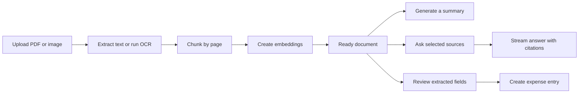
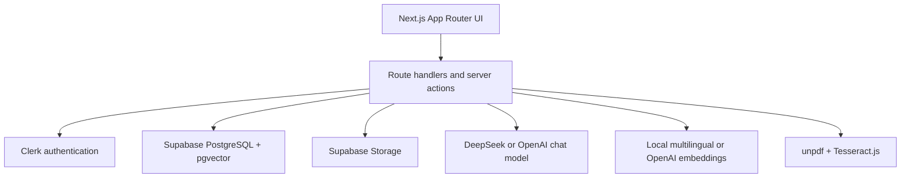

# NexusOps

NexusOps is an AI operations workspace for turning business documents into searchable, verifiable knowledge. Users can upload PDFs or scanned images, extract their text, generate structured summaries, ask questions across selected sources, inspect page-aware citations, and convert invoice or receipt data into an expense dashboard.

The application is built for document-heavy operational work where an answer is only useful when its source remains visible.

## What the project does

- Uploads and privately stores PDF, JPG, PNG, and WebP documents up to 20 MB.
- Extracts native PDF text and falls back to OCR for scanned or image-only pages.
- Supports English and Amharic OCR by default.
- Chunks documents with page metadata and creates vector embeddings.
- Combines semantic and keyword retrieval using reciprocal rank fusion.
- Streams AI answers grounded only in documents selected for a conversation.
- Preserves page-aware citations and evidence excerpts with saved messages.
- Generates streamed, structured document summaries and exports them as PDF or CSV.
- Classifies invoices, receipts, contracts, and other documents.
- Extracts operational fields with confidence scores and source evidence.
- Promotes reviewed invoice and receipt data into an expense dashboard.
- Keeps conversation history, document selections, and user data isolated by workspace.
- Provides English and Amharic interface translations.

## Product workflow



Document processing moves through visible states:

`UPLOADED → OCR_PROCESSING → OCR_COMPLETED → CHUNKING → EMBEDDING → READY`

If processing fails, the document moves to `FAILED` and can be retried from the workspace.

## Core areas

### Document workspace

The document workspace manages uploads, processing status, previews, summaries, structured extraction, exports, retries, and deletion. Stored files use user-scoped paths inside a private Supabase Storage bucket.

### Ask Nexus

Ask Nexus lets a user choose the ready documents that can participate in a conversation. Each question is embedded, passed through tenant-scoped hybrid retrieval, and answered from a bounded context window. Responses stream to the interface while their retrieved passages are saved as message sources.

### Structured operations

After a document becomes searchable, NexusOps attempts an additive structured extraction. The model classifies the source and returns grounded fields such as vendor, date, currency, total, category, and document number. Missing or weakly supported values are marked for review instead of being guessed.

### Expense dashboard

Confirmed invoice or receipt extractions can become expense entries. The dashboard groups operational spending by date, vendor, currency, and category while retaining a link to the source document and its evidence.

## Architecture



### Retrieval design

The `match_documents` PostgreSQL function performs tenant-scoped hybrid retrieval over ready documents:

1. It filters chunks by application user, selected document IDs, and optional tags.
2. Vector candidates are ranked by cosine similarity.
3. Keyword candidates are ranked with PostgreSQL full-text search.
4. Weighted reciprocal rank fusion combines both result sets.
5. Consecutive chunks are grouped and trimmed to the configured context budget.
6. Sources are labeled `S1`, `S2`, and so on for inline citation.

The default local embedding model produces 384-dimensional multilingual vectors that are padded to the database's 1,536-dimensional storage format. OpenAI embeddings can be enabled without changing the schema.

## Technology stack

| Area | Technology |
| --- | --- |
| Application | Next.js 16 App Router, React 19, TypeScript 5 |
| Styling | Tailwind CSS 4, shadcn/ui, Motion, GSAP |
| Authentication | Clerk |
| Database | Supabase PostgreSQL, Prisma 7, pgvector |
| File storage | Supabase Storage |
| AI streaming | Vercel AI SDK |
| Chat providers | DeepSeek by default, OpenAI optional |
| Embeddings | Hugging Face Transformers locally, OpenAI optional |
| PDF and OCR | unpdf, PDF.js, Tesseract.js, Sharp, napi-rs/canvas |
| Internationalization | i18next and react-i18next |
| Charts | Recharts |
| Testing | Vitest, Playwright, ESLint |

## Repository structure

```text
src/
├── app/
│   ├── api/                  # Chat, document, expense, and Clerk webhook routes
│   ├── sign-in/              # Clerk sign-in route
│   ├── sign-up/              # Clerk registration route
│   ├── workspace/            # Authenticated overview, documents, expenses, and chat
│   └── page.tsx              # Public landing page
├── components/
│   ├── ai/                   # Streaming markdown and citation rendering
│   ├── landing/              # Landing-page sections
│   └── ui/                   # Shared interface primitives
├── i18n/                     # Language configuration and provider
├── lib/
│   ├── ai/                   # Provider and embedding adapters
│   ├── auth/                 # Application-user resolution
│   ├── db/                   # Prisma client
│   ├── documents/            # OCR, chunking, extraction, summaries, and PDF export
│   ├── expenses/             # Expense types and helpers
│   ├── rag/                  # Retrieval, evidence, and context construction
│   └── supabase/             # Supabase server clients
└── messages/                 # English and Amharic copy

prisma/
├── migrations/               # Base schema and incremental SQL migrations
└── schema.prisma             # Current application data model

e2e_tests/                    # Public and authenticated Playwright coverage
tests/stubs/                  # Test-only module stubs
```

## Prerequisites

- Node.js 22 or newer
- pnpm 9.5.0
- A Supabase project with PostgreSQL, Storage, and the `vector` extension
- A Clerk application
- A DeepSeek API key for the default chat and summary configuration, or an OpenAI API key when using OpenAI chat
- Optional: an OpenAI API key for hosted embeddings

## Local setup

### 1. Install dependencies

```bash
pnpm install
```

### 2. Create the environment file

Copy the example and fill in the values for your development services:

```bash
cp .env.example .env.local
```

On PowerShell:

```powershell
Copy-Item .env.example .env.local
```

In addition to the values already shown in `.env.example`, database migrations, Prisma, storage, and Clerk webhooks use the following variables:

```dotenv
# PostgreSQL
DATABASE_URL=postgresql://...
DIRECT_URL=postgresql://...

# Supabase Storage; defaults to "documents"
SUPABASE_STORAGE_BUCKET=documents

# Clerk webhook verification
CLERK_WEBHOOK_SECRET=whsec_...
```

### Environment reference

| Variable | Required | Purpose |
| --- | --- | --- |
| `NEXT_PUBLIC_CLERK_PUBLISHABLE_KEY` | Yes | Clerk browser configuration |
| `CLERK_SECRET_KEY` | Yes | Clerk server authentication and user lookup |
| `CLERK_WEBHOOK_SECRET` | Recommended | Verifies Clerk user lifecycle webhooks |
| `NEXT_PUBLIC_SUPABASE_URL` | Yes | Supabase project URL |
| `NEXT_PUBLIC_SUPABASE_ANON_KEY` | Yes | Supabase browser/session configuration |
| `SUPABASE_SERVICE_ROLE_KEY` | Yes | Trusted server access to database and storage |
| `DATABASE_URL` | Yes | Runtime Prisma PostgreSQL connection |
| `DIRECT_URL` | Yes | Direct PostgreSQL connection used by Prisma tooling |
| `SUPABASE_STORAGE_BUCKET` | No | Private file bucket; defaults to `documents` |
| `AI_PROVIDER` | No | Chat provider: `deepseek` by default or `openai` |
| `DEEPSEEK_API_KEY` | For DeepSeek | DeepSeek authentication |
| `DEEPSEEK_BASE_URL` | No | DeepSeek API base URL |
| `DEEPSEEK_MODEL` | No | Default DeepSeek and summary model |
| `RAG_CHAT_MODEL` | No | Optional DeepSeek override for grounded chat |
| `OPENAI_API_KEY` | For OpenAI | OpenAI chat or embedding authentication |
| `OPENAI_BASE_URL` | No | OpenAI-compatible base URL |
| `OPENAI_CHAT_MODEL` | No | OpenAI chat model; defaults to `gpt-4o-mini` |
| `EMBEDDING_PROVIDER` | No | `local` by default or `openai` |
| `LOCAL_EMBEDDING_MODEL` | No | Local Hugging Face feature-extraction model |
| `OPENAI_EMBEDDING_MODEL` | No | OpenAI embedding model |
| `OCR_LANGUAGES` | No | Tesseract language list; defaults to `eng+amh` |
| `RAG_MATCH_THRESHOLD` | No | Minimum vector similarity; defaults to `0.32` |
| `RAG_MATCH_COUNT` | No | Maximum retrieved chunks; defaults to `14` |
| `RAG_MAX_CONTEXT_TOKENS` | No | Approximate retrieval context budget |
| `RAG_MAX_OUTPUT_TOKENS` | No | Grounded-answer output budget |
| `SUMMARY_MAX_OUTPUT_TOKENS` | No | Summary output budget, clamped to 1,000–12,000 |
| `E2E_CLERK_USER_EMAIL` | Tests only | Dedicated Clerk user for authenticated E2E tests |

Never expose the Clerk secret, Supabase service-role key, database URLs, or model API keys to client-side code.

### 3. Prepare the database

Enable the `vector` and `pgcrypto` extensions, then apply the SQL files in this order through the Supabase SQL editor or an equivalent PostgreSQL client:

1. `prisma/migrations/init.sql`
2. `prisma/migrations/20260721_clerk_user_sync.sql`
3. `prisma/migrations/20260724_conversation_documents.sql`
4. `prisma/migrations/20260724_rag_hybrid_search.sql`
5. `prisma/migrations/20260802090000_add_document_extractions/migration.sql`
6. `prisma/migrations/20260803100000_add_expense_dashboard_indexes/migration.sql`

The hybrid-search migration creates the full-text and HNSW indexes, row-level security policies, and the service-role-only `match_documents` function.

Generate the Prisma client after the schema is available:

```bash
pnpm prisma generate
```

### 4. Create document storage

Create a private Supabase Storage bucket named `documents`, or use the name configured in `SUPABASE_STORAGE_BUCKET`. Upload paths are scoped by Clerk user ID, and file access is performed by authenticated server routes.

### 5. Configure Clerk

Add the publishable and secret keys to `.env.local`. For proactive user synchronization, create a Clerk webhook pointing to:

```text
https://your-domain.example/api/webhooks/clerk
```

Subscribe it to:

- `user.created`
- `user.updated`
- `user.deleted`

Store the webhook signing secret as `CLERK_WEBHOOK_SECRET`. NexusOps also creates a missing application-user record on the first authenticated request, so local development is not blocked while the webhook is being configured.

### 6. Start the application

```bash
pnpm dev
```

Open [http://localhost:3000](http://localhost:3000). The public landing page is available at `/`, while authenticated product areas live under `/workspace`.

The first OCR request downloads its Tesseract language data into `.cache/tesseract`, and the first local embedding request loads the configured Hugging Face model into the runtime cache. Initial document processing can therefore take longer than subsequent requests.

## Application routes

| Route | Description |
| --- | --- |
| `/` | Public product landing page |
| `/sign-in` | Clerk sign-in |
| `/sign-up` | Clerk registration |
| `/workspace` | Authenticated operations overview |
| `/workspace/documents` | Document collection and upload flow |
| `/workspace/documents/[documentId]` | Preview, summary, extraction, and evidence review |
| `/workspace/ask` | Selected-source grounded chat and history |
| `/workspace/expenses` | Expense metrics and evidence-linked entries |

## Commands

| Command | Description |
| --- | --- |
| `pnpm dev` | Start the Next.js development server |
| `pnpm build` | Generate Prisma Client and create a production build |
| `pnpm start` | Run the production server |
| `pnpm lint` | Run ESLint |
| `pnpm test` | Run the Vitest unit suite once |
| `pnpm test:watch` | Run unit tests in watch mode |
| `pnpm test:e2e` | Run Playwright tests |
| `pnpm test:e2e:ui` | Open Playwright's interactive test UI |

For a faster browser check:

```bash
pnpm test:e2e --project=chromium
```

## Testing

Vitest covers deterministic document chunking, extraction normalization, summary formatting, and citation/evidence behavior. Playwright covers the public landing page, language switching, protected workspace navigation, tenant-scoped document loading, and upload validation.

Authenticated Playwright projects are enabled only when all of these are present:

```dotenv
E2E_CLERK_USER_EMAIL=e2e+clerk_test@example.com
NEXT_PUBLIC_CLERK_PUBLISHABLE_KEY=pk_test_...
CLERK_SECRET_KEY=sk_test_...
```

Use a dedicated Clerk development user and a non-production Supabase project. The temporary signed-in browser state is written to the ignored `playwright/.clerk` directory.

## Security model

- Every server operation resolves the authenticated Clerk user to an internal application user.
- Document, conversation, extraction, and expense queries include the internal user ID.
- Hybrid retrieval accepts the user ID explicitly and only searches that user's ready documents.
- PostgreSQL row-level security protects user-facing reads.
- The `match_documents` function is restricted to the Supabase service role.
- Uploaded files live in a private storage bucket under user-scoped paths.
- Structured extraction treats document contents as untrusted data and requires evidence for non-null fields.
- Clerk webhooks are signature-verified before user records are changed.
- Sensitive server credentials are never intended for `NEXT_PUBLIC_*` variables.

## Deployment notes

- Use a Node.js 22-compatible hosting environment.
- Configure every required environment variable in the deployment platform.
- Apply database migrations and create the private storage bucket before the first production upload.
- Point the Clerk webhook at the production `/api/webhooks/clerk` endpoint.
- Document processing and summary routes use the Node.js runtime and may run for up to 300 seconds.
- Local embeddings require the bundled ONNX runtime and model cache; OpenAI embeddings reduce deployment size at the cost of a hosted API dependency.
- `next.config.ts` includes native runtime files needed by document processing and constrains build concurrency for memory-limited environments.
- Verify that the hosting platform allows the processing duration, native packages, and post-response work required by the upload pipeline.

## Current scope

NexusOps is centered on source-grounded document operations. It does not attempt to replace a general file drive or accounting ledger. Extracted facts remain suggestions until reviewed, generated summaries should be checked against their source, and cited answers are limited by the quality of the uploaded document and OCR output.

## License

No open-source license is currently declared. Add a `LICENSE` file before distributing or accepting external contributions under specific terms.
